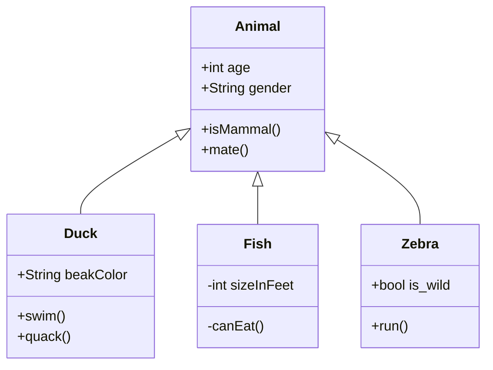

При первом подключений нового пользователя срабатывает `first_power`<swm-token data-swm-token=":main.py:81:2:2:`def first_power():`"/>
<!-- NOTE-swimm-snippet: the lines below link your snippet to Swimm -->
### 📄 main.py
```python
81     def first_power():
82         if os.path.isfile(session_path):
83             print("Файл существует")
84         else:
85             session = {}
86             with open(session_path, 'w') as file:
87                 # Записываем данные в JSON-файл
88                 json.dump(session, file)
```

<br/>

<!--MERMAID {width:100}-->

<!--MCONTENT {content: "classDiagram<br/>\nAnimal <|-- Duck<br/>\nAnimal <|-- Fish<br/>\nAnimal <|-- Zebra<br/>\nAnimal : +int age<br/>\nAnimal : +String gender<br/>\nAnimal: +isMammal()<br/>\nAnimal: +mate()<br/>\nclass Duck{<br/>\n+String beakColor<br/>\n+swim()<br/>\n+quack()<br/>\n}<br/>\nclass Fish{<br/>\n\\-int sizeInFeet<br/>\n\\-canEat()<br/>\n}<br/>\nclass Zebra{<br/>\n+bool is\\_wild<br/>\n+run()<br/>\n}<br/>\n\n<br/>"} --->

<br/>

This file was generated by Swimm. [Click here to view it in the app](https://app.swimm.io/repos/Z2l0aHViJTNBJTNBQVZEX2JvdFRlbGVncmFtJTNBJTNBSXZhbmdvMTI4/docs/ngiaimhv).
